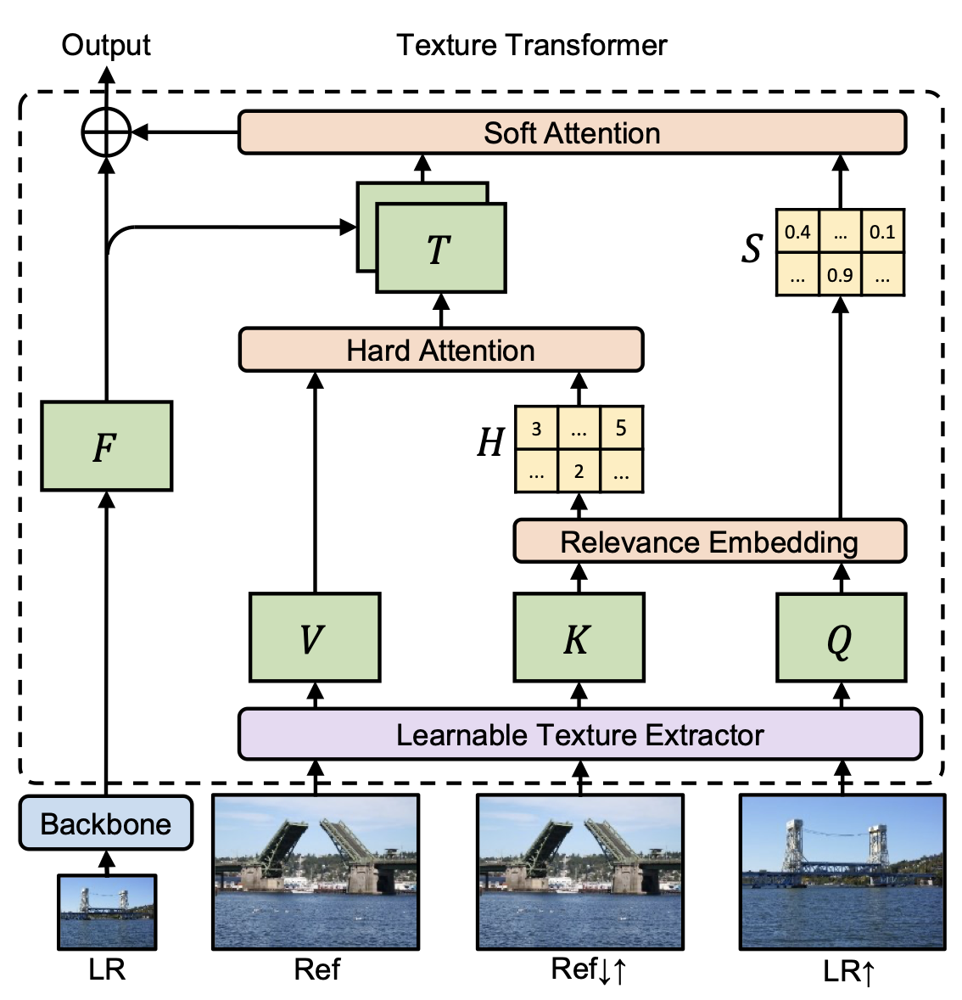
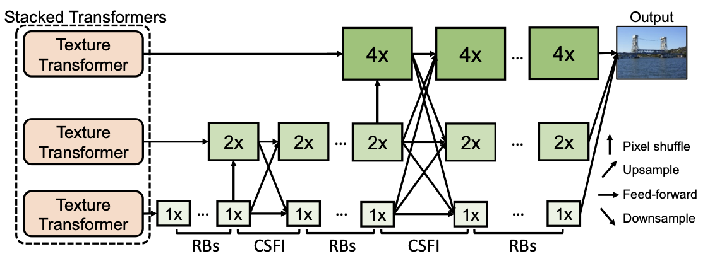
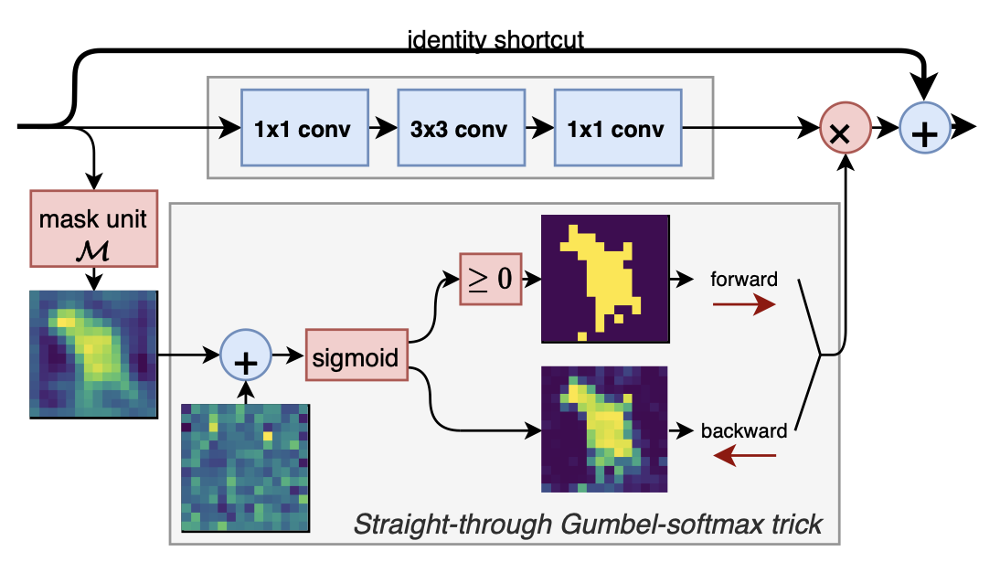
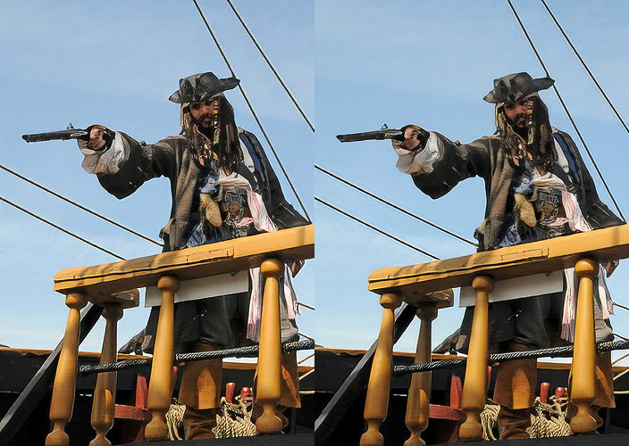

# Learning Texture Transformer Network for Image Super-Resolution (analysis)

[Learning Texture Transformer Network for Image Super-Resolution](https://arxiv.org/pdf/2006.04139.pdf) is one of the most advanced methods for super-resolution using reference frames.

Therefore it is extremely interesting to understand why it produces such a good result and is where any room to reduce the size of the network while keeping the perfomance. For that purpose we provided several experiments and found a balance.

We have also provided rigorous analysis and came up with an advancement (injection of sparse dynamic convolutions) that boosts the quality of this SOTA network to the new level.





All the details about experiments that were provided on **TTSR** are explained in the `report.pdf`.

[Video presentation](https://drive.google.com/file/d/1g2RRHqYdGptNbvBOIv6LPKDkyWhiRsUe/view?usp=sharing)

[Google Drive with all the results we obtained](https://drive.google.com/drive/folders/1m3XDS7lHJmz9uIY0TgAD1V-tX-oHVeyR?usp=sharing)

## Prerequisites

* pytorch
* pytorch_lightning
* torchvision
* kornia
* cv2
* numpy
* imageio
* tqdm

## Related repositories

* [Original TTSR](https://github.com/researchmm/TTSR)
* [Sparse dynamic convolutions](https://github.com/thomasverelst/dynconv)

## Repository structure

There are specific entities that performs specific tasks:

* `main.py`: the entry to the pipeline, has bash interface (the main and only interface).
* `reproduce_colab.ipynb`: notebook with ready code stubs to reproduce the results.
* composers: the "guys" that encapsulate training/validation loops + parsing utilities of config.
* config: there are different configs for train and test stages of a pipeline. Each config is distributed in the corresponding experiment folder. Configs that contains \*\_warmup\_\* in their name are for pretraining stage. Others for fine-tuning. They are designed to be self-explanatory, but for reproducing probably the most important parameter is `log_save_dir` (location where logs, plots and checkpoints will be stored) and `dataset_dirpath` (location of the dataset). 
* dataset: pytorch dataset entities.
* model: implementations of the models. If new one is added, it should be imported to the base composer to be able to parse it from the config files.

## Dataset

CUFED Dataset is used for all the experiments. Used in the same manner as authors of TTSR applied it.

* [CUFED Train dataset](https://drive.google.com/drive/folders/1hGHy36XcmSZ1LtARWmGL5OK1IUdWJi3I)
* [CUFED Test (Validation) dataset](https://drive.google.com/file/d/1Fa1mopExA9YGG1RxrCZZn7QFTYXLx6ph/view)

After dataset is downloaded make the following structure:

* train
    * input
    * ref
* test
    * CUFED5

Then specify in a config:

```yaml
train_dataset: 'CufedTrainDataset'
train_num_workers: 4  # Or any other desired workers
train_dataset__kwargs:
  dataset_dirpath: 'path/to/train'

val_dataset: 'CufedTestDataset'
val_num_workers: 2
val_dataset__kwargs:
  dataset_dirpath: 'path/to/test'
```

## Experiments

To reproduce each experiment use `reproduce_colab.ipynb` in the Google Colab environment (We performed experiment on Nvidia V100 and Nvidia P100 with 16Gb of memory). There are stubs for environment setup, dataset extraction and commands to launch the chosen experiment.

After all setup is done. You should run three comands to reproduce experiment `x` (the paths to the scripts and configs may differ in your environment):

### Pretraining for 2 epochs (~10min on Nvidia V100)

```bash
# Do not forget to put a number instead of x
python main.py --config config/train/exp_{x}/ttsr_warmup_colab.yml \
    -g 0 \ 
    -L 'logs'  # Path for logs and checkpoints
```

### Fine-tuning for 50 epochs (~10hours on Nvidia V100)

```bash
# Do not forget to put a number instead of x
# -b: Obtained during the pretraining (checkpoints are saved in the logs directory)
python main.py --config config/train/exp_{x}/ttsr_colab.yml \ 
    -g 0 \ 
    -b 'path/to/pretrained/checkpoint' \ 
    -L 'logs'  # Path for logs and checkpoints
```

### Get predictions on validation dataset
```bash
python main.py --config config/test/exp_{x}/ttsr_colab.yml \
    -g 0 \
    --modes predict \
    -m 'path/to/finetuned/checkpoint' \
    -O 'path/to/where/save/predicted/images'
```

### Test on validation dataset
```bash
# Npte that test configs are unified (e.x. instead of exp_3_1 just exp_3)
python main.py --config config/test/exp_{x}/ttsr_colab.yml \
    -g 0 \
    --modes test \
    -m 'path/to/finetuned/checkpoint'
```

### (Optional) Plot the training losses with Tensorboard

```bash
tensorboard --logdir path/to/logs
```

> To train the TTSR on the original pipeline, just follow the guide from the authors repository.
> Experiment 10 was provided on the original pipeline, you can follow their instructions (but just use a black reference frame to reproduce the result). We also prepared a guide in `exp_10.ipynb`.

## Highlighted results



  

